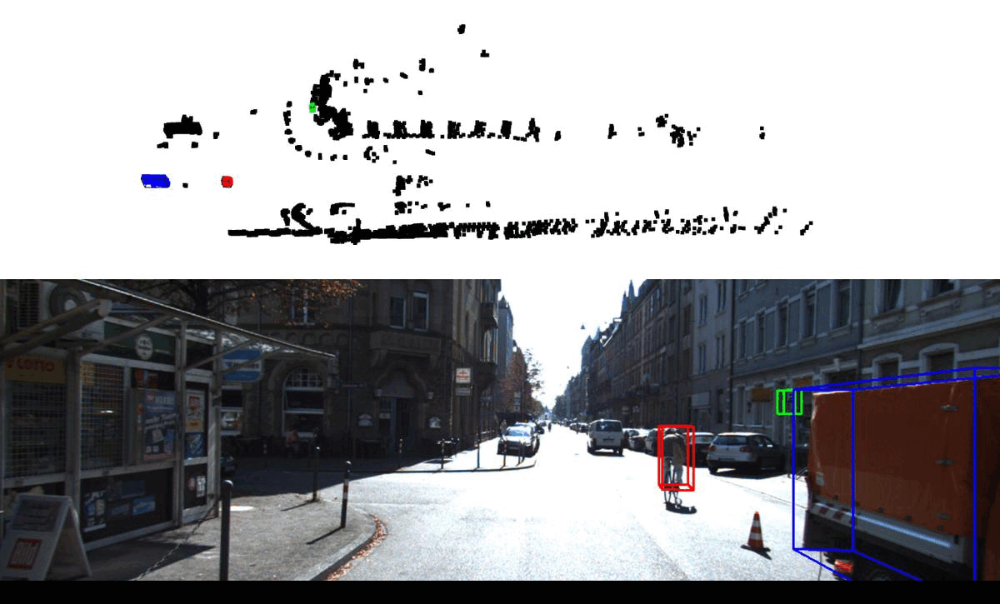

## 3D Object Detection from Point Cloud on KITTI

### Overview

This repository contains the code for 3D object detection from Point Cloud on KITTI. 

### File usage

**generate_label.py ** turn all groundtruth labels "Car,Van,Truck,Tram" into "Vehicle"

**extract_data.py** **kitti_utils.py** segment Cyclist, Pedestrian and Vechicles point cloud based on groundtruth label on training set. Segment the background by DBSCAN clustering.

**data_augmentation.py** augment clustered data by removing the dataset with little point and balancing the number of data in different catagory. One example of augmented data is put in the ./augmented_data directory.

**model.py** **train.py** train the processed dataset on PointNet . Some pre-trained mode is put in the ./model directory

**newvis.py** visualize the result using trained model and generate bounding box on both 3D and 2D

